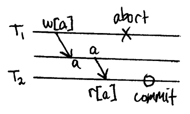
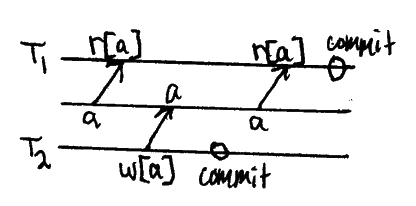
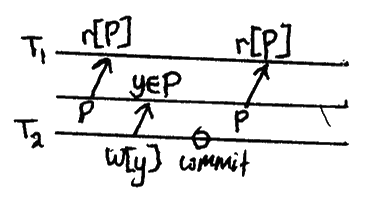
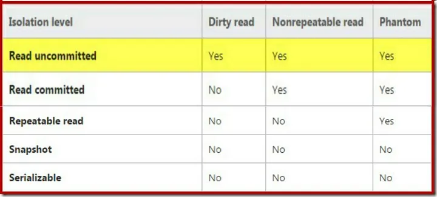
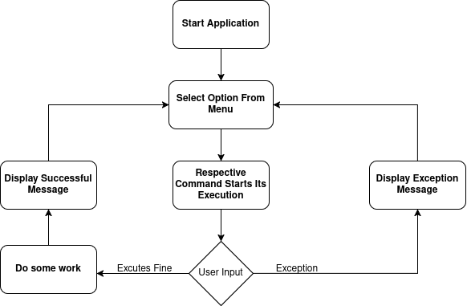
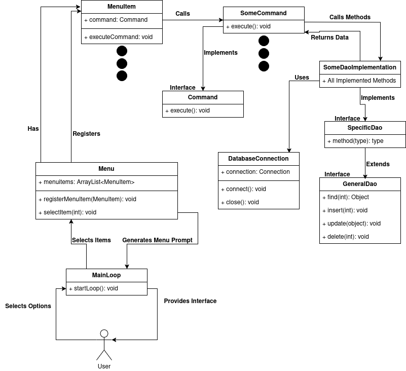
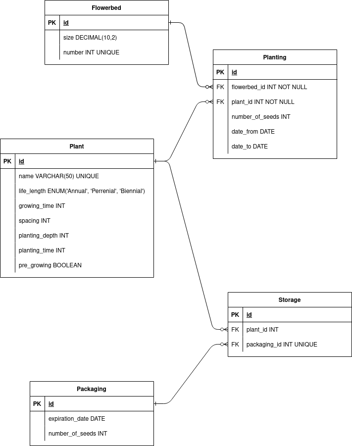
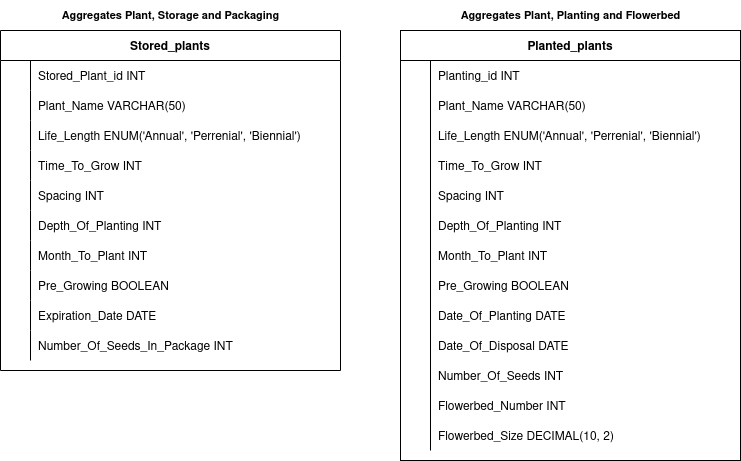

Context
===

Introduction
---

Multiple users can access and query a database at the same time. The database engine takes care of those multiple sessions. This is very practical and makes things fast, but can introduce some problems. Before we introduce those problems, we need to address one key concept in database handling and programming, database transactions. 

Database Transactions
---

A transaction is a set of commands, which starts with a special keyword and ends with one, usually the *commit* keyword. Database transactions ensure, that only valid data are written into the database. If any problem occurs during a transaction, all the commands the transaction executed can be rolled back.       
Let's take a practical example. You send money from your bank account to a non-existent bank account. Lets suppose the program, which carries out money transaction, does not check, whether the account exists beforehand. The money are deducted from your account, then the program attempts to add them to the non-existent account. It of course runs into an error and needs to put things back to the state they were before and inform the client, that the account does not exist. If we did not have database transactions, we would have no practical way to revert the deduction of our money. Of course in this case we could just run a command, which will add the respective amount of money back to our account. But what if there are a lot more commands during this transaction? It would be very tidious and annoying to carry them out backwards manually. Thats exactly the reason we have database transactions. From the start of the transaction, the database keeps a log, in which we can find all the commands executed during this database transaction. If any problem arises in the process, we can call the *rollback* command, which will, with the help of the transaction log, automatically revert all the commands executed by this database transaction.              
When we combine transactions with multi session environment, certain complications may arise. I will show you three most common ones, although we will look only at two of them in the code. After the examples, we will introduce a mechanism, which database engines employ against these complications.               

Dirty Read
---

First of our problems and easiest to mitigate is called **Dirty Read**. Dirty read appears when one transaction reads some data, which were modified by another transaction, which was aborted after. If the problem isnt obvious, let me explain. When the second transaction is aborted (rolled back), the data it modified during the get rolled back to the state, it was right before the start of this transaction. So the first transaction reads a value, that is not up to date.               
There is a very easy mitigation to this. You just dont allow the other transaction to read a value, that was modified but not commited.



Non-Repeatable Read
---

Second on is named **Non-Repeatable Read**. It is very similar to a dirty read with one important difference. Here, when the second process reads the updated value, the value is already commited. So the first transaction reads a value, but when it reads it again, at the end for example, it has a different value (the value was commited to the database before the first transaction has commited).            
There is also quite a simple mitigation for that. If someone reads a value, you forbid another transaction to change that value, until the first one has commited.



Phantom Read
---

The last one is called **Phantom Read**. Phantom read occours when during one transaction, another transaction adds another record into the table and commits. When the second transaction read the table again, it finds out, that a new row has been added.       
This can be solved for example by locking the whole table, after a transaction touches it. Althought this is a little brutal solution, it works.



Database Isolation Levels
---

In order to address these problems, database engines use something called isolation levels. There are four of them specified in the ANSI SQL. In the picture below, there is one extra, dont pay attention to it.       



**Read Uncommited** makes sure other transaction cannot update a row, which has been already updated by another transaction, but not yet commited. It does not say anything about reading that value tho. So naturally, it permits all of the phenomena mentioned. Some database engines (like Oracle and Postgres) dont even have an option to set this databse isolation level.       
**Read Commited** is able to protect again dirty reads, because it also does not allow to read to a changed row, which has not yet been commited. All the other phenomena are still possible tho.          
**Repeatable Read** is even more restrictive. It ensures that no transaction will modify data, which other transaction has read, thus also preventing non-repeatable reads. Phantom reads are still possible with this isolation level, at least according to ANSI SQL. But keep in mind, that some database engines actually employ some kind of protection against phantom reads even on this isolation level.                
**Serializable** is the highest level of isolation. At this isolation level, the database engine typically locks the whole table, if any transaction intracts with it, so no new rows can be added.         
Important thing to note is, that with each more isolation comes performance decrease.

What this program shows
---

This program works with a simple database named *garden*. With the help of this database, it demostrates Non-Repeatable read and Phantom Read. It also has the option to change the isolation level of your database.           
It uses a MariaDB database.


Documentation
===

Setup
---

NOTE: This program is only startable on Linux machine, it is not tested at all on any other operating system. There rest of this documentation will assume you are working in a Linux environment!

First clone the GitHub repo of this project using this command:

```shell
git clone <URL of this repo>
```

or you can download the zip file.

Then you will need to configure your database. This project is meant to be used with MariaDB database. You will need to
set up this database on your machine. Here is a good enough tutorial from DigitalOcean, even with creating a new user:        

https://www.digitalocean.com/community/tutorials/how-to-install-mariadb-on-ubuntu-20-04

The process will be very similar on other distributions.         
After that you will need to import the database with some sample data. You can find the whole script, which was produced
by mysqldump in the uppermost directory under the name *garden.sql*. You can do this by this command:      

```shell
sudo mariadb < garden.sql
```

Then we will start the mariadb shell by this command:

```shell
sudo mariadb
```

You will be logged in as the root user, which can do everything.    
We will then need to create a new user for our database. In order for the views to work properly, we need to create a
user named *gardenAdmin*. We can create him and grant him privileges like so:

```sql
CREATE USER 'gardenAdmin'@localhost IDENTIFIED BY 'admin';
GRANT ALL PRIVILEGES ON garden.* TO 'gardenAdmin'@localhost IDENTIFIED BY 'admin';
```

After all that is done, you will need to make a copy of the *config_template.properties* file, which is in the
uppermost directory, and put it in the directory, where the .jar file resides (*/out/artifacts/PV_Lambda_jar/*). 
Then you need to rename it to *config.properties*. According to the template values, rewrite them to values, which
correspond to your database. If you installed your MariaDB locally, the template URL should work out of the box.            
The last thing you need to do is start the program. Navigate yourself to the */out/artifacts/PV_Lambda_jar/* folder and
start the program with this command:

```shell
java -jar PV-Lambda.jar 
```

Note that this program uses java 21, so you should start it with a compatible version

How To Use
===

In the main menu, you simply type the number displayed on the left to the menu item and press enter. The respective
menu item will walk you through its steps.          
If you want to stop the program, simply type *end* and press enter

Operation Diagram
===



Program Architecture
===



Database Diagram
===

Tables
---



Views
---



Import of Data
===

The program provides a way to input some data in a csv file. In the uppermost directory, there is an example
csv file called *example_values.csv*. This file can demonstrate, which format of a csv file will the program
accept. If your csv file will be different or one of the values will be invalid, the program will tell you,
and it will not continue and will rollback the insert.

Exceptions and Errors
===

This application deals with errors and exceptions in a simple way. It alerts the user, if something happened,
in a textual way and lets them perform it again or fix the problem. There are not any significant errors that 
need to be handled in a special way. The program is quite durable, it will not crash, even when the database 
connection is not working. It is also very simple so no extensive error handling was really needed.             
One thing that maybe should be mentioned is with the property file. If configured incorrectly, the program will tell you
and nothing will work as intended. Pay really close attention to your username, password, database url and if your user
really has all the rights for the database.

Third Party Libraries
===

com.opencsv - opencsv - version 5.9           
de.vandermeer - asciitable - version 0.3.2

Resume
===

This project is supposed to demonstrate a simple application, which interacts with a database. It is also meant to
show the concepts of **Non-Repeatable Read** and **Phantom Read**.              
It uses a dynamically built menu, where each menu item performs an independent command.             
In order to communicate with the database a sort of wrapper is used, called DatabaseConnection. An unlimited number
of these connections can be created during the program. This can potentially present an issue, but in order to make
the concepts examples work, it such a way. But note that if the programmer follows certain principles and always closes
the connection after using it, this should not prove a problem.         
In order to communicate with the database, this program will use several database access objects. They provide different
methods used to interact with a certain table or view. The results of these queries often utilize or return objects,
which have directly mapped attributes to the database tables. Except for foreign keys, they are represented by the
referenced object itself.           

Sources
===

Nader Medhat - Understanding Database Isolation Levels - https://medium.com/nerd-for-tech/understanding-database-isolation-levels-c4ebcd55c6b9          
Telusko - Java Database Connectivity | JDBC - https://youtu.be/7v2OnUti2eM?feature=shared            
Java Code Junkie - DAO For Beginners - https://www.youtube.com/watch?v=3J5L40MJfU4&list=PL3bGLnkkGnuX_Pa95v_FUdazcFhEF7iBi
